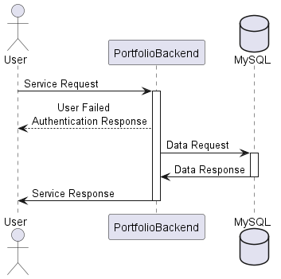

# PortfolioBackend 📁
A .NET 7 API for managing contact information and user data.

- [**Introduction**](#introduction)
- [**Getting Started**](#getting-started)
- [**Usage**](#usage)
- [**API Endpoints**](#api-endpoints)
- [**Testing**](#running-tests)
- [**Deployment**](#deployment)
- [**Technologies**](#built-with)
- [**Contributing**](#contributing)
- [**Versioning**](#versioning)
- [**Authors**](#authors)
- [**License**](#license)
- [**Acknowledgments**](#acknowledgments)

## Introduction 🌐
PortfolioBackend is a versatile API designed for storing contact details and user information. Features include CRUD operations, authentication, and hosting support on Azure. Explore our [Documentation](https://github.com/coleman399/DillonColeman_PortfolioWebsite_Backend/tree/develop/PortfolioBackend/Documentation) or access the /Documentation endpoint locally. Note: The Postman collection is only available in production [here](http://portfoliowebsitebackend.azurewebsites.net/Documentation/). 

Swagger UI is available [here](https://portfoliowebsitebackend.azurewebsites.net/swagger/index.html).

Coming Soon: Our frontend for this project. Stay Tuned!

## Getting Started 🚀
Want to get a local copy up and running? Follow these steps:

1. **Setup**:
    - Clone this repository.
    - Launch the solution in Visual Studio.
    - Manage your User Secrets for the PortfolioBackend project.

2. **User Secrets Configuration**:
    - [Details on initializing and configuring secrets](https://learn.microsoft.com/en-us/aspnet/core/security/app-secrets?view=aspnetcore-7.0&tabs=windows)

3. **Run**:
    - Navigate to PortfolioBackend terminal.
    - Use the `dotnet watch run` command or hit the green play button.

4. **Tests**:
    - Open another PortfolioBackend terminal.
    - Run tests using the `dotnet test` command.

5. **Prerequisites**:
    - [Visual Studio](https://visualstudio.microsoft.com/vs/getting-started/)
    - [Docker Desktop](https://www.docker.com/products/docker-desktop/)
    - [MySql Workbench](https://dev.mysql.com/downloads/workbench/)

6. **Installation & Production**:
    - A comprehensive guide for production setup is available [here](https://learn.microsoft.com/en-us/azure/app-service/quickstart-dotnetcore?tabs=net70&pivots=development-environment-vs).
    - A Key Vault guide can be found [here](https://learn.microsoft.com/en-us/aspnet/core/security/key-vault-configuration?view=aspnetcore-7.0#secret-storage-in-the-production-environment-with-azure-key-vault).
    
## Usage 🖥

  

## API Endpoints 📌
Swagger UI is available [here](https://portfoliowebsitebackend.azurewebsites.net/swagger/index.html).

## Running Tests 🧪
- Use Visual Studio's Test Explorer.
- Check Test Discovery status.
- Hit the green play button.

_Future update will introduce test containers._

## Deployment 🚢
We use Docker and Azure Container Repository for deployment. Navigate [here](https://learn.microsoft.com/en-us/visualstudio/containers/deploy-app-service?view=vs-2022) for detailed deployment strategies.

## Built With 🛠
- **Tokenization**: BCrypt
- **Email**: MailKit
- **Logging**: Serilog
- **Testing**: NUnit/Specflow
- **Documentation**: Swagger
- **Deployment**: Docker/Azure Container Registry
- **Database**: MySql
- **ORM**: Entity Framework Core
- **Authentication**: JWT
- **Versioning**: Asp.Versioning
- **Hosting**: Azure App Service
- **Monitoring**: Azure Application Insights

## Contributing 🤝
Open to suggestions and feedback. Contact me for queries!

## Versioning 🏷

Our Branching strategy:

Main branch contains latest version.  
Rollback branch contains the last version.   
Develop branch contains the only branch allowed to be worked on.  
Feature/Bugfix branches are created from Develop and merged back into Develop.  

Updates will be incremented in decimal form until reaching next complete version. Each whole number represents a major update..

## Authors ✍️
**Dillon Coleman**  
- 📧: coleman399@gmail.com  
- 🔗: [LinkedIn](https://www.linkedin.com/in/dillonthedev/)

## License 📜
This project is under the MIT license.

## Acknowledgments 🙏
Thank you for exploring PortfolioBackend. Happy coding! 💻