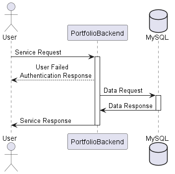

 # PortfolioBackend
- [Introduction](#introduction)
- [Getting Started](#getting-started)
    - [Prerequisites](#prerequisites)
    - [Installation](#installation)
- [Usage](#usage)
- [API Endpoints](#api-endpoints)
- [Running Tests](#running-tests)
- [Deployment](#deployment)
- [Built With](#built-with)
- [Contributing](#contributing)
- [Versioning](#versioning)
- [Authors](#authors)
- [License](#license)
- [Acknowledgments](#acknowledgments)

## Introduction
A .NET 7 API for storing contact information and user data, including CRUD operations, login/logout functionality, using a MySQL database, and hosted on Azure.

Check out the Documentation [here](https://github.com/coleman399/DillonColeman_PortfolioWebsite_Backend/tree/main/Documentation)

Don't forget to check out the *coming soon* [frontend]() for this project.

## Getting Started
These instructions will get you a copy of the project up and running on your local machine for development and testing purposes.

- Clone the repo
- Open the solution in Visual Studio
- Right click on the PortfolioBackend project and select "Manage User Secrets"
    - If you don't have a user secrets file, you will be prompted to create one
    - If not, it is possible that you haven't enabled secret storage for your user account
		- To do this, open a command prompt and run the following command:
		```
		dotnet user-secrets init
		```
		- Then, attempt to open the user secrets file again
		- If you need additional help, see [this article](https://docs.microsoft.com/en-us/aspnet/core/security/app-secrets?view=aspnetcore-3.1&tabs=windows#enable-secret-storage)
- Once you've gain access to your secrets.json, add the following set of secrets using your own information
	- "AzureMySqlDb" < - > "Server=yourserver;Database=yourdatabase;Uid=yourusername;Pwd=yourpassword;"
		* you won't need the this information yet, but it will be necessary to run in production
	- "LocalMySqlDb" <- if you want to test application using MySql Workbench before Azure MySql 
    - "EmailSettings:DisplayName" 
	- "EmailSettings:From"
	- "EmailSettings:Host"
	- "EmailSettings:Password"
	- "EmailSettings:Port"
	- "EmailSettings:UserName"
	- "JWTSecurityKey"
	- "SuperUserEmail"
	- "SuperUserPassword"
	- "SuperUserUserName"
- Right click the PortfolioBackend and select Open in Terminal 
- Verify that you're using the development launch setting and run the following command: 
		```
		dotnet watch run
		```
		OR press the green play button
	- If errors, try to clean and rebuild solution, verify user secrets, check logs
	- If you are still having issues, please reach out to me and I will assist best I can
- Once you've confirmed that the api runs, open another PortfolioBackend terminal and run the following command: 
		```
		dotnet test
		```

### Prerequisites
- Basics
	- Visual Studio <-> [download](https://visualstudio.microsoft.com/vs/getting-started/)
- Things you need to install if you plan on using this api in production 
	- Docker Desktop < - > [download](https://www.docker.com/products/docker-desktop/)
	- MySql Workbench < - > [download](https://dev.mysql.com/downloads/workbench/)

### Installation
A step by step guide that will tell you how to get the production environment up and running.

- Right click PortfolioBackend project and hover over Add, then select Docker support, Target OS Linux
	- this should generate a Dockerfile for you
- Verify Docker Desktop is up and running, and that you've selected the Docker launch setting
- Run the application
	- Read an errors and fix according, most likely a configuration issue. If you need help please reach out.
- Now that we can generate an image in Docker, still in a Development Enviroment, we need to set up Azure
	- There are serveral ways of doing this.
		1. Right click the project and select Publish
			- The Publish UI should appear, enter the following conditions
				- if you don't know are have no options, Select Create New
					1. Target = Azure			
					2. Specify target = Azure Container Registry
					3. Registry = Create new select it
					4. Container build = Docker Desktop
		2. Navigate to [Azure Portal](https://portal.azure.com/)
			- Create an account if you haven't already
			- Using the search bar Find and Create a Container registry
			- Using the search bar Find and Create a Key vault
			- Using the search bar Find and Create an App Service
			- Using the search bar Find and Create an Azure Database for MySQL flexible server
	- Back in Visual Studio, right click on Connected Services within the PortfolioBackend project, and select Manage Connected Services	
	- Connect Azure Key Vault
	- Back in Azure Portal, Update your newly created Key Vault with the same configuration you used for the user secrets.
		- For email setting, I created one secret name EmailSettings, added a Json object with the settings, then parsed the secret at run time
	- Navigate to your Web Service, using the left navigation under settings, select Identity
		- Verify that system assigned is on
	- Navigate to your Key Vault, using the left navigation, select Access control (IAM)
		- Add Role assignment
			- Under Role Tab, Select Key Vault Secrets User
			- Under Members Tab, Select Managed identity, then + Select members, select your subscription, the app service, and the api itself
		- Review and assign
	- Navigate to your Azure Database for MySQL flexible server
		- Add Role assignment
			- Under Role Tab, Select Reader
			- Under Members Tab, Select Managed identity, then + Select members, select your subscription, the app service, and the api itself
		- Review and assign
	- Navigate to your Container registry
		- Add Role assignment
			- Under Role Tab, Select AcrPull
			- Under Members Tab, Select Managed identity, then + Select members, select your subscription, the app service, and the api itself
		- Review and assign
	- Navigate to your Web Service
		- Using the left navigation panel, Select Deployment Center
			- Under Settings, Select Container Registry 
			- Container type = Single Container, Select Managed identity, your container registry, the image, tag = latest, and Turn on Continuous deployment 
		- Save
- Navigate to your Azure Database for MySQL flexible server, using the left navigation under settings, select Connect 
- Click MySQL Workbench and follow the instructions to connect to your database
- Back in Visual Studio, using the production launch settings, run the api and confirm vault secrets are being read and connection to the database
	- if you are struggling to connect to vault, 
	    - right click Connected Services within PortfolioBackend and select Manage Connected Services
		- try reconnecting to the keyvault
		- recheck permissions
		- verify your connected to the correct vault
	- if you are stuggling to connect to database,
		- check if MySql Workbench is connected to the database, [Workbench Docs](https://dev.mysql.com/doc/workbench/en/)
		- check connectionstring in vault matches the mysql connectionstring in Azure
		- recheck permissions
- Once you have the keyvault and database connected, migrate the database using ef tools
	- if you don't have ef installed run the following command: 
	```
	dotnet tool install --global dotnet-ef
	```
	- Example migration commands - Replace <<CONTEXT>> with UserContact/ContactContext: 
	```
	dotnet ef migrations add <<NAME>> --context <<CONTEXT>>
	dotnet ef database update --context <<CONTEXT>>
	```
- Run Tests then Publish
- After Publishing completes head back to your Azure Portal - Web Service and Select Overview from the left navigation panel 
- Under the Logs tab, Select View log stream
- Check everything went well
	- Try not to get frustrated! almost there
	- don't forget to check the container repo and deployment center for clues
- Once you've successfully deployed the api, Navigate back to Overview and Select Health Check
- Enable and add /healthcheck to Path
- Success - Congrats! From here on, it is all you. Explore features and add resources as needed. I suggest Application Insights.
			
## Usage

<p align="center">
  
</p>

## API Endpoints

<p align="center">
  <a src="./Documentation/LivingDoc-8.7.23.html" alt="Please view the LivingDoc.html found within the Documentation folder"/>
</p>

## Running Tests
In Visual Studio, Navigate to the test explorer
	- if no tests are present, check if Test Discovery is turned on by clicking the gear icon
Click the green play button 

In a future update, we will use test containers to run all tests.

## Deployment
Single Container Deployment using Docker and Azure Container Repository.

There currently three branches. Main, Develop, and Rollback. Rollback carries the last version, main the latest. Should the need to roll back, pull the rollback branch and publish.

## Built With
- BCrypt <- Tokens 
- MailKit <- Email
- Serilog <- Logging
- Specflow <- Acceptance Testing
- NUnit <- Unit Tests
- Docker <- Deployment Strategy
- Azure <- Api host

## Contributing
Please contact me if you have questions or would like to suggest something. I'm very open and would love feedback!

## Versioning
We are using the Asp.Versioning Package as our versioning tool. Branching strategy - main, latest version | rollback, the last version. Updates will be incremented in decimal form until reaching next version. Each whole number represents a major update. 

## Authors
Dillon Coleman
Email: coleman399@gmail.com
[LinkedIn](https://www.linkedin.com/in/dillonthedev/)

## License
This project is licensed under the terms of the MIT license.

## Acknowledgments
- Thank you for your time. Happy Coding! <3